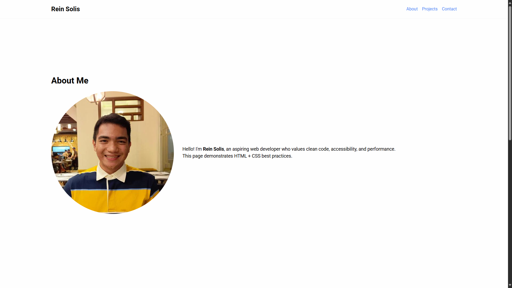
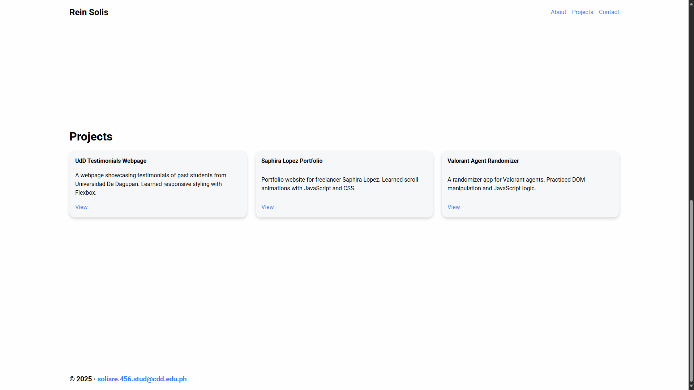

# Rein Solis – Portfolio Website

## 📌 Purpose

This project is a personal portfolio website showcasing my skills, projects, and background as an aspiring web developer. It demonstrates **HTML + CSS best practices**, clean design principles, and responsive layouts for different screen sizes.

## 🚀 How to Open

1. Clone or download this repository.
2. Open the `index.html` file in any modern web browser (Google Chrome, Firefox, Edge, Safari).
3. Navigate through the **About**, **Projects**, and **Contact** sections via the header links.

_No build tools or installations are required — it runs with plain HTML, CSS, and JavaScript._

## ♿ Accessibility Notes

- Uses semantic HTML (`header`, `main`, `section`, `footer`) for better screen reader compatibility.
- Includes descriptive **alt text** for images.
- Maintains **high-contrast colors** for readability.
- Layout adapts to **tablet and mobile screens** with responsive CSS.
- Content fades in/out smoothly as you scroll, but still remains accessible if animations are disabled (prefers-reduced-motion support).

---

© 2025 Rein Solis
